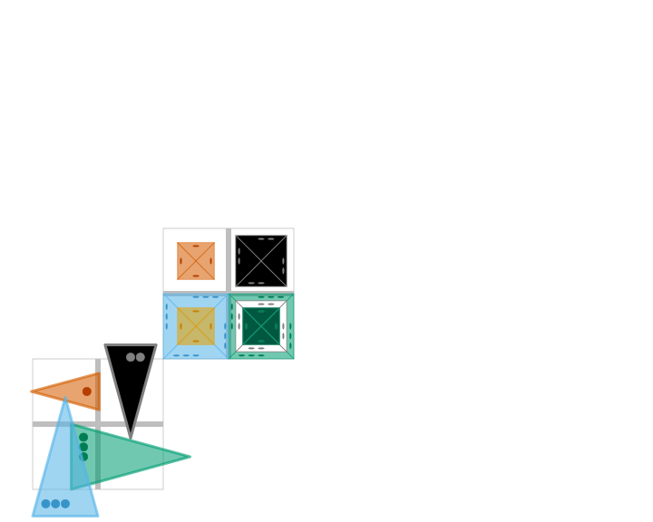

piecenikr: Looney Pyramids graphics
===================================

[](https://travis-ci.org/piecepackr/piecenikr)
[](https://ci.appveyor.com/project/piecepackr/piecenikr)
[](https://codecov.io/github/piecepackr/piecenikr?branch=master)
[](http://www.repostatus.org/#wip)

Looney Pyramids aka Icehouse pieces is a game system invented by Andrew Looney.  The following are good sites of information about Looney Pyramids:

* https://www.looneylabs.com/looney-pyramids (official site)
* https://www.icehousegames.org/wiki/index.php?title=Main_Page (unofficial wiki)

This R package provides a `looney_pyramids` configuration that make it easier to make Looney Pyramids graphics with [piecepackr](https://github.com/piecepackr/piecepackr).

```r
library("piecepackr")
library("piecenikr")
dft <- tibble(piece_side="tile_back", x=1.5, y=1.5, suit=NA, rank=NA, angle=NA)
dfp <- tibble(piece_side=c("pyramid_face", "pyramid_left", "pyramid_right", "pyramid_back"),
              x=c(1,2,2,1), y=c(2,2,1,1), suit=1:4, rank=c(1:3,3), angle=seq(90, 360, 90))
df1 <- rbind(dft, dfp)

dft <- tibble(piece_side="tile_back", x=3.5, y=3.5, suit=NA, rank=NA, angle=NA)
dfp <- tibble(piece_side="pyramid_top", x=2+c(1,2,2,1,1,2,2,2), y=2+c(2,2,1,1,1,1,1,1),
              suit=c(1:6,2,3), rank=c(1:3,3,1,2,1,1), angle=seq(0, 630, 90))
df2 <- rbind(dft, dfp)
df <- rbind(df1, df2)

pmap_piece(df, cfg=looney_pyramids, default.units="in")
```


