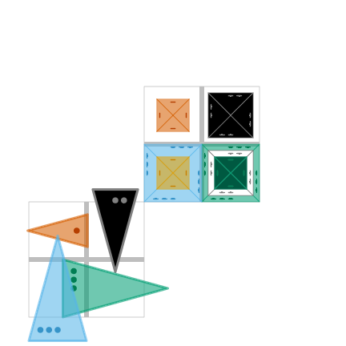
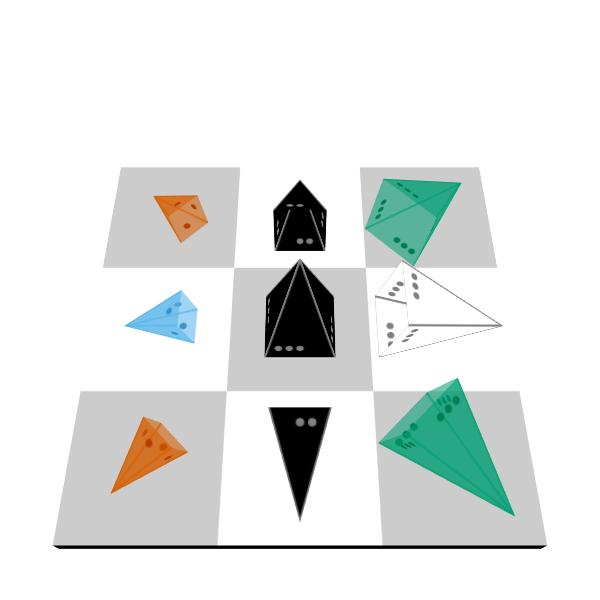
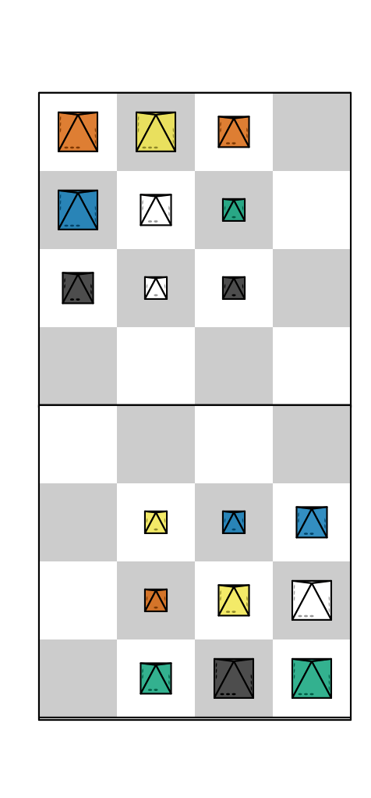

piecenikr: Looney Pyramids graphics
===================================

.. image:: https://github.com/piecepackr/piecenikr/workflows/R-CMD-check/badge.svg
    :target: https://github.com/piecepackr/piecenikr/actions
    :alt: R-CMD-check

.. image:: https://codecov.io/github/piecepackr/piecenikr/branch/master/graph/badge.svg
    :target: https://app.codecov.io/github/piecepackr/piecenikr?branch=master
    :alt: Coverage Status

.. image:: http://www.repostatus.org/badges/latest/wip.svg
   :alt: Project Status: WIP – Initial development is in progress, but there has not yet been a stable, usable release suitable for the public.
   :target: http://www.repostatus.org/#wip

.. _piecepackr: https://github.com/piecepackr/piecepackr
.. _R: https://www.r-project.org/

Looney Pyramids aka Icehouse pieces is a game system invented by Andrew
Looney. The following are good sites of information about Looney
Pyramids:

-  https://www.looneylabs.com/looney-pyramids (official site)
-  https://www.icehousegames.org/wiki/index.php?title=Main_Page
   (unofficial wiki)

This R package provides a ``looney_pyramids()`` configuration that make it
easier to make Looney Pyramids graphics with piecepackr_.

License
-------

- The **code** of this R package is licensed under the `Creative Commons Attribution-ShareAlike 4.0 International license <https://creativecommons.org/licenses/by-sa/4.0/>`__.  
  This license is compatible with version 3 of the GNU Public License (GPL-3).

- Under American law I likely cannot claim any copyright on any Looney Pyramid
  graphical **output** (e.g. game diagrams and animations) a user creates with this package.
  Furthermore, I relinquish any copyright claims to such graphical **output** in any jurisdiction 
  (if any exist) that does grants me any such rights.

- Looney Pyramids are trademarked and patented by `Looney
  Labs <https://www.looneylabs.com/>`__. They do not permit commercial
  use of Looney Pyramids without permission. They seem cool with

  1. Creating `new Looney Pyramids
     games <https://www.icehousegames.org/wiki/index.php?title=Community_Games>`__.
     `But don’t try to independly publish such a game while including
     Looney Pyramids in your
     product <https://faq.looneylabs.com/non-gameplay-questions/working-with-looney-labs#1770>`__
     nor `creating commercial electronic versions of Looney Pyramids
     games <https://www.looneylabs.com/looney-labs-electronic-arcade>`__.
  2. `Making Icehouse
     pieces <https://www.icehousegames.org/wiki/index.php?title=Making_pieces>`__
     for personal use (note they definitely `would mind if someone
     commercially manufactured icehouse pieces without
     permission <http://wunderland.com/WTS/Andy/Games/PatentsAndLawsuits.html>`__)
  3. (Non-commercial) fan art and game playing aids

Installation
------------

Within R_ do:

.. code:: r

    install.packages("remotes")
    remotes::install_github("piecepackr/piecepackr")
    remotes::install_github("piecepackr/ppgames") # suggested
    remotes::install_github("piecepackr/piecenikr")

Examples
--------

This package contains a ``looney_pyramids()`` configuration. One can draw
2D graphics using ``grid.piece()``.

.. sourcecode:: r
    

    library("piecepackr")
    library("piecenikr")
    library("tibble")
    cfg <- looney_pyramids()$icehouse_pieces
    
    dft <- tibble(piece_side="tile_back", x=1.5, y=1.5, suit=NA, rank=NA, angle=NA)
    dfp <- tibble(piece_side=c("pyramid_face", "pyramid_left", "pyramid_right", "pyramid_back"),
                 x=c(1,2,2,1), y=c(2,2,1,1), 
                 suit=1:4, rank=c(1:3,3), angle=seq(90, 360, 90))
    df1 <- rbind(dft, dfp)
    
    dft <- tibble(piece_side="tile_back", x=3.5, y=3.5, suit=NA, rank=NA, angle=NA)
    dfp <- tibble(piece_side="pyramid_top",
                  x=2+c(1,2,2,1,1,2,2,2),
                  y=2+c(2,2,1,1,1,1,1,1),
                 suit=c(1:6,2,3), 
                 rank=c(1:3,3,1,2,1,1), 
                 angle=seq(0, 630, 90))
    df2 <- rbind(dft, dfp)
    df <- rbind(df1, df2)
    
    pmap_piece(df, grid.piece, cfg = cfg, default.units = "in")

    Example 2D diagram

One can use ``piece3d()`` to draw 3D graphics using the ``rgl`` package:

.. sourcecode:: r
    

    dfb <- tibble(piece_side = "board_face",
                  x = 0, y = 0, suit = 6, rank = 3, cfg = "checkers2")
    dfp1 <- tibble(piece_side = "pyramid_top", x=0, y=0, rank = 3, suit = 2,
                   cfg = "icehouse_pieces")
    dfp2 <- tibble(piece_side = "pyramid_face", 
               x = rep(c(-2, 0, 2), 3),
               y = rep(c(2, 0, -2), each=3),
               angle = c(45, 0, -45, 90, 0, -90, 135, 180, -135),
               suit = rep(1:6, length.out=9), 
               rank = rep(1:3, length.out=9),
               cfg = "icehouse_pieces")[-5, ]
    df <- dplyr::bind_rows(dfb, dfp1, dfp2)
    
    library("rgl")
    invisible(open3d())
    view3d(phi=-30, zoom = 0.8)
    if (Sys.which("wmctrl") != "") system("wmctrl -r RGL -e 0,-1,-1,600,600")
    envir = c(looney_pyramids(), game_systems("sans3d"))
    pmap_piece(df, piece3d, envir = envir, trans = op_transform, scale = 0.99)
    Sys.sleep(2)
    rgl.snapshot("man/figures/3d_looney_pyramids.png")

   Example 3D diagram

There are also functions which perform board set ups for games that use Looney Pyramids:

1. ``df_martian_chess()`` sets up `Martian Chess <https://www.looneylabs.com/rules/martian-chess>`_, an abstract by Andrew Looney.
2. ``ppdf::piecepack_alien_city()`` sets up `Alien City <http://www.ludism.org/ppwiki/AlienCity>`_, an abstract by Michael Schoessow.

Here is an exmaple of using ``df_martian_chess()`` and the `PPN <https://trevorldavis.com/piecepackr/portable-piecepack-notation.html>`_ parser ``ppgames::read_ppn()`` in order to animate a game of Martian Chess.

.. sourcecode:: r
    

    library("ppgames")
    game <- read_ppn(system.file("ppn/martian-chess.ppn", package = "piecenikr"))[[1]]
    envir <- c(looney_pyramids(), game_systems())
    animate_game(game, file = "man/figures/martian-chess.gif",
                 annotate = FALSE, envir = envir,
                 n_transitions = 6L, n_pauses = 4L, fps = 8,
                 trans = op_transform, op_scale = 0.25, op_angle = 90,
                 pt_thickness = 0.3)

   Animation of a game of Martian Chess
